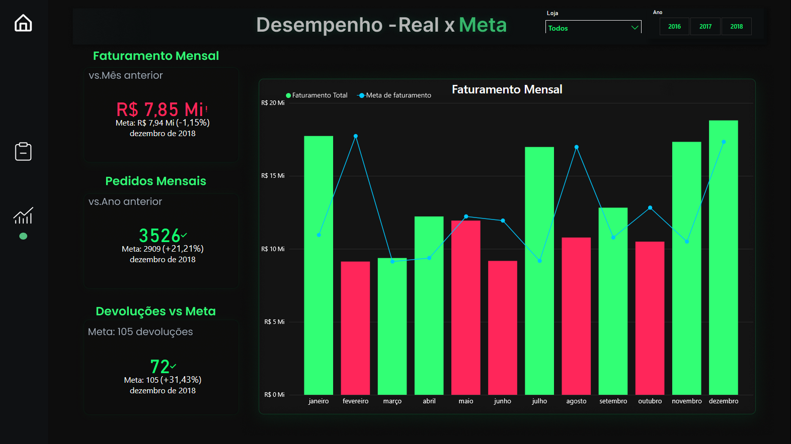

 # Projeto de Análise de dados - Análise de Vendas e Performance 📈

 

# Informações do Projeto
- Este projeto apresenta uma **Análise de Vendas e Performance** construída a partir de dados coletados de uma rede fictícia de comércios.
- O objetivo é transformar dados de vendas, produtos e lojas em **insights acionáveis** para melhorar receita, margem e eficiência operacional
 

##  💻Etapas do projeto
1. **Definição do problema**
   - Identificar indicadores chave (faturamento, ticket médio, margem, vendas por produto/região).
   - Entender decisões a suportar (devoluções, metas de faturamento em relação ao mês anterior, priorização de lojas).

2. **Coleta e preparação dos dados**
   - Extração de dados das fontes (Planilhas Excel).

3. **Modelagem**
   - Criação de um modelo tabular simples (Fatos: vendas e devoluções. Dimensões: produtos, lojas, clientes,).

4. **Desenvolvimento do dashboard (Power BI)**
   - Páginas: Visão Geral, Lucro por Produto, Desempenho por Loja/Região, Análise Temporal, Análise de devoluções, Faturamento x Meta.
   - Métricas e medidas DAX para KPIs chave.

5. **Entrega**
   - Publicação do .pbix e imagens neste repositório.
   - Link para o dashboard online disponível mais abaixo
# 🛠️ Ferramentas utilizadas
 Microsoft Excel
 
 Microsoft Power Bi
 
# Dashboard Interativo
- [Clique aqui para visualizar o dashboard de maneira interativa](https://app.powerbi.com/view?r=eyJrIjoiNGI2MmM2NTUtMWFiYS00ODU2LWJlMDgtODE3MDMwMDUwYThlIiwidCI6IjcwY2NiOWM1LTc4NjgtNGYxMi05NTUxLTJjYmE1YTE5NWUxYyJ9)
 

 

 

## ❓ Perguntas do negócio (exemplos) — e como o dashboard responde
- **Como está o desempenho geral de vendas?**  
  O dashboard mostra crescimento consistente no último mês comparado ao anterior. Devido a grande concentração de lojas na região Sudeste, ela é líder em vendas totais.
  Pode ser notado também que há uma alta nas vendas nos meses de janeiro, julho e dezembro, indicando que essa alta pode ser relacionada com as férias/recessos dos clientes, que incentiva a movimentação dos comércios.
  

- **Como anda o lucro obtidos nos produtos, marcas e categorias?**  
  Analisando a parte dos lucros, nas categorias podemos observar que em todos os anos celular apresentou o maior lucro, bem pelo fato de uma relação postiiva entre custo total e lucro total.  
  Os celulares da marca Apple são os que apresentam o maior lucro na categoria. A marca Dell é campeã de venda da categoria notebook, enquanto as outras marcas Acer e Samsung andam lado a lado no lucro. 
  Televisão é um produto pouco rentável, apresenta uma baixa margem de lucro, tendo uma relação entre custo total e lucro total muito negativa. 
  A maior margem de lucro das categorias é representada pela Câmera que possui três marcas Dell, Nikon e Sony que todas tem um lucro parecido e muito alto.
  

- **Como anda as devoluções, lojas cumprindo a meta de 3% do total de pedidos?**  
  Explorando o dashboard pode ser analisado que existem muitas lojas que não estão conseguindo manter as devoluções abaixo da meta.
  

 - **Como anda as metas de faturamento e de pedidos?**  
Na página de Desempenho x Meta podemos analisar que a meta é sempre em relação ao mês anterior a fim de obter sempre crescimento nas vendas, e que em alguns meses com vendas baixas essas metas não são alcançadas.  
Os pedidos mensais sempre são comparados ao ano anterior e a loja consegue realizar muitas vendas mas fica a desejar em alguns meses no faturamento.
 

# BÔNUS - Dica de Ferramenta - Tooltip

  
  
